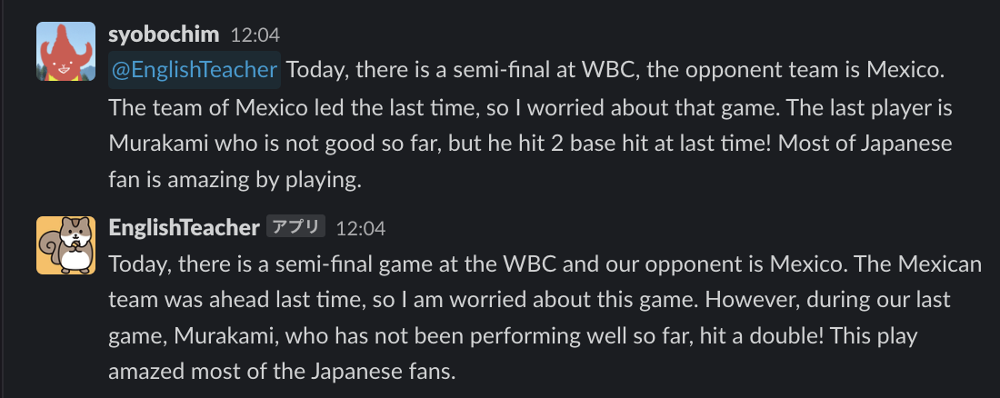

# EnglishTeacherBot

ChatGPT API を使って英語の添削をする Slack Bot



メンションした文章に対して修正をし、添削のポイントも返す。

## Setting (AWS)

AWS Systems  Manager に以下を事前に登録する

- Key : englishTeacherAPI / Value : Slack API Token
- Key : openAiSecret / Value : Open AI API Key
  - https://platform.openai.com/account/api-keys

`src/lambda` ディレクトリにて以下のコマンドを実行し、ライブラリをインストールする

```
$ npm install
```

CDK で AWS 環境へデプロイする

初回のみ

```
$ cdk bootstrap
```

デプロイ

```
$ cdk deploy
```

## Setting (Slack)

Slack Appの作成:

1. [SlackApi your apps](https://api.slack.com/apps) にアクセスし、右上の「Create New App」ボタンをクリックして、 From Scratch の新しいアプリを作成します。 
2. アプリ名と開発ワークスペースを入力し、「Create App」をクリックします。

ボット機能の追加:

1. アプリの管理ページ（Basic Information）のDisplay Informationで、ボットの表示名とデフォルトのアイコンを設定します。

ボットへの権限の追加:
1. 左サイドバーの「OAuth & Permissions」をクリックします。
2. OAuth Tokens for Your Workspace でトークンを取得します。（AWS Systems Manager にこのトークンを設定します。）
3. 「Scopes」セクションで、 `app_mentions:read` と `chat:write` を追加します。

ボットのイベント設定:

1. アプリ管理ページで、左サイドバーの「Event Subscriptions」をクリックします。 
2. 「Enable Events」をオンにし、「Request URL」にボットのエンドポイントURL(API GatewayのURL)を入力します。 
3. 「Subscribe to bot events」の中で「Add Bot User Event」をクリックし、app_mentionイベントを追加します。これにより、ボットがメンションされたときに通知を受け取ることができます。 
4. 変更内容を保存します。
